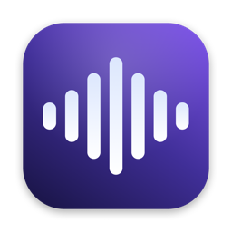

<div align="center">
  
  <h1>VoxOS</h1>
  <p>A native macOS voice dictation + voice-to-action agent, for personal use</p>

  [](https://www.gnu.org/licenses/gpl-3.0)
  
</div>

---

VoxOS is a native macOS voice dictation and voice-to-action agent, built for my own day-to-day use —
not distributed or sold.

It does two things:

1. **Dictation** — hold a shortcut, speak, and it transcribes locally (Whisper / Parakeet) and pastes cleaned-up
   text wherever your cursor is.
2. **Agent Mode** — hold a different shortcut, speak a request, and it acts on your Mac: add calendar events,
   set reminders, draft emails, send WhatsApp/Slack/iMessage messages, find files, open apps and URLs, and more,
   using a provider-agnostic JSON tool-calling loop (works with local Ollama, Local CLI, or any hosted provider).

## Features

- 🎙️ **Local transcription** — Whisper.cpp / Parakeet models, fully offline
- 🤖 **Agent Mode** — 27 voice-triggered tools (calendar, reminders, notes, mail drafts, WhatsApp, Slack,
  Linear, iMessage, file search, app/URL opening, memory, system utilities)
- ⚡ **One-click Agent setup** — a quick-install button wires up a working AI provider, the built-in Agent
  prompt, and a Control+Option hold-to-talk shortcut automatically
- 🧠 **Modes** — per-app/per-URL configuration for transcription + AI enhancement behavior
- 🔒 **Privacy-first** — transcription is always local; the agent loop can run entirely on-device via Ollama
- 🖥️ **Notch-docked recorder UI** — a compact panel that molds around the camera notch, with a left-edge
  hover history sidebar for past interactions

## Build from Source

See [BUILDING.md](BUILDING.md) for the general build instructions. This fork additionally requires:

```shell
xcodebuild -project VoxOS.xcodeproj -scheme VoxOS -configuration Debug \
  -derivedDataPath "$PWD/.local-build" \
  -xcconfig LocalBuild.xcconfig \
  -skipPackagePluginValidation -skipMacroValidation \
  CODE_SIGN_IDENTITY="-" CODE_SIGNING_REQUIRED=NO CODE_SIGNING_ALLOWED=YES \
  DEVELOPMENT_TEAM="" \
  CODE_SIGN_ENTITLEMENTS="$PWD/VoxOS/VoxOS.local.entitlements" \
  SWIFT_ACTIVE_COMPILATION_CONDITIONS='$(inherited) LOCAL_BUILD' \
  build
```

(Needs the Metal toolchain installed once via `xcodebuild -downloadComponent MetalToolchain`.)

## Requirements

- macOS 14.4 or later

## License

Licensed under the GNU General Public License v3.0 — see [LICENSE](LICENSE).

## Acknowledgments

- [whisper.cpp](https://github.com/ggerganov/whisper.cpp) — Whisper model inference
- [FluidAudio](https://github.com/FluidInference/FluidAudio) — Parakeet model implementation
- [TranscribeCpp for Swift](https://github.com/Beingpax/Transcribe-cpp-swift) — local GGUF transcription models
- [SenseVoice Small](https://huggingface.co/FunAudioLLM/SenseVoiceSmall) — multilingual model
- [Sparkle](https://github.com/sparkle-project/Sparkle), [KeyboardShortcuts](https://github.com/sindresorhus/KeyboardShortcuts),
  [LaunchAtLogin](https://github.com/sindresorhus/LaunchAtLogin), [MediaRemoteAdapter](https://github.com/ejbills/mediaremote-adapter),
  [Zip](https://github.com/marmelroy/Zip), [SelectedTextKit](https://github.com/tisfeng/SelectedTextKit),
  [Swift Atomics](https://github.com/apple/swift-atomics)

---

Personal project by Achyuth KP.
